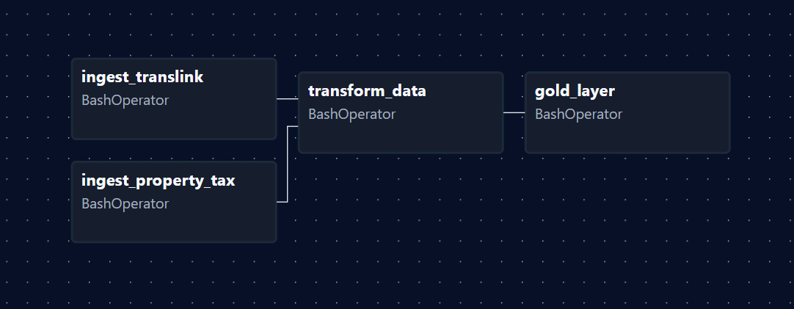

# Vancouver Housing & Transit Pipeline

> Does proximity to SkyTrain stations affect property values in Vancouver?
> This pipeline answers that question using real open data, orchestrated with Apache Airflow.

## What This Project Does

Pulls Vancouver property tax assessment data and TransLink's GTFS transit feed, joins them using a spatial distance calculation (Haversine formula), aggregates the results into neighbourhood-level summaries, and serves them via a REST API. The pipeline runs on a weekly Airflow schedule.

## Architecture

```
[Vancouver Open Data API]       [TransLink GTFS API]
          |                              |
          v                              v
    +------------------------------------------+
    |         Bronze Layer  (Raw Parquet)       |
    |  property_tax_raw.parquet                 |
    |  skytrain_stations_raw.parquet            |
    +-------------------+----------------------+
                        | PySpark
                        v
    +------------------------------------------+
    |         Silver Layer  (Cleaned)           |
    |  properties_cleaned/                      |
    |  properties_with_transit/                 |
    |  (spatial join at neighbourhood level)    |
    +-------------------+----------------------+
                        | PySpark
                        v
    +------------------------------------------+
    |         Gold Layer  (Aggregated)          |
    |  neighbourhood_summary/                   |
    |  (avg values by transit proximity)        |
    +-------------------+----------------------+
                        |
           +------------+------------+
           v                         v
    FastAPI REST API          Apache Airflow
    GET /api/neighbourhoods   Weekly schedule
    localhost:8000/docs       localhost:8080
```



**Note on Airflow's role:** Airflow acts purely as a scheduler and monitor. It triggers `pipeline.py` via BashOperator and watches the result. All PySpark logic lives in `pipeline.py` and the transformation modules. This separation was intentional — running PySpark inside Airflow tasks directly caused JVM memory conflicts crashing and was not possible due to the severe lack of memory. Keeping them separate solved the memory problem and keeps each piece focused on what it does best.

## Tech Stack

| Layer | Technology |
|-------|------------|
| Ingestion | Python + Requests |
| Transformation | PySpark 3.5 |
| Orchestration | Apache Airflow 3.1 |
| Storage | Parquet (Medallion Architecture) |
| API | FastAPI + Pydantic |
| Infrastructure | Docker + Docker Compose |
| CI/CD | GitHub Actions |

## Quick Start

```bash
# 1. Clone the repo
git clone https://github.com/HanxxFeli/vancouver-housing-transit
cd vancouver-housing-transit

# 2. Add your TransLink API key (free at developer.translink.ca)
cp .env.example .env
# Edit .env and add your TRANSLINK_API_KEY

# 3. Build and run the full pipeline
make build
make run

# 4. Start Airflow (for scheduling and monitoring)
docker-compose up airflow-standalone -d
# Open http://localhost:8080

# 5. Start the API
docker-compose up api -d
# Open http://localhost:8000/docs
```

## Makefile Commands

The `Makefile` wraps common Docker commands so you don't have to remember them:

| Command | What it does |
|---------|-------------|
| `make build` | Builds the Docker image |
| `make run` | Runs the full pipeline (ingest + transform + gold) |
| `make run-dev` | Skips ingestion — faster during development when bronze data already exists |
| `make test` | Runs the data quality test suite inside Docker |
| `make lint` | Runs black, isort, and flake8 locally to format and check your code |
| `make clean-data` | Deletes silver and gold layers so you can reprocess from bronze |
| `make clean-all` | Full reset — deletes all data including bronze |
| `make ps` | Shows which containers are currently running |

## API Endpoints

| Endpoint | Description |
|----------|-------------|
| `GET /health` | API status and data availability |
| `GET /api/neighbourhoods` | All 30 Vancouver neighbourhoods with stats |
| `GET /api/neighbourhoods/{code}` | Stats for one neighbourhood |
| `GET /api/neighbourhoods/{code}/transit-analysis` | Property values broken down by transit proximity |

## CI/CD — GitHub Actions

Every push to `main` or `develop` triggers two automated jobs:

**Job 1 — Lint & Format Check**
Runs `black`, `isort`, and `flake8` against the codebase to enforce consistent formatting and catch style issues before they reach main. If any file would be reformatted, the job fails. Fix locally with `make lint` before pushing.

**Job 2 — Data Quality Tests**
Runs only after Job 1 passes. Spins up Python 3.11 and Java 17 (required for PySpark), installs dependencies, and runs `pytest src/tests/`. The tests validate that pipeline outputs have the expected shape, types, and no unexpected nulls. Ingestion is skipped in CI since there are no API keys on the runner — tests focus on transformation logic instead.

This means every PR to `main` is automatically checked for formatting and data correctness before it can be merged.

## Key Engineering Decisions

**Why does pipeline.py handle the heavy lifting instead of Airflow?**

Airflow is used purely as a scheduler and monitor — it triggers `pipeline.py` via BashOperator and watches the result. Running PySpark inside Airflow tasks directly caused memory issues because Airflow's executor competed with the JVM for heap space. Separating concerns — Airflow owns scheduling, pipeline.py owns execution — solved the memory problem and kept each piece focused on what it does best.

**Why join at the neighbourhood level instead of property level?**

The property tax dataset has neighbourhood codes but not individual GPS coordinates. A property-level cross join (1.5M properties x 50 stations = 75M combinations) exceeded available memory on a local setup. Joining at the neighbourhood level (30 neighbourhoods x 50 stations = 1,500 combinations) produces the same result because all properties in a neighbourhood share the same centroid coordinate. The correct next iteration would be geocoding individual addresses for true property-level joins using H3 spatial indexing.

**Why PySpark instead of pandas?**

The dataset has 1.5M+ rows across multiple report years. PySpark's API is identical whether running locally or on a cluster — this code is production-ready without changes. For the API serving layer where the gold data has only 30 rows, pandas is used instead. Always use the right tool for the data size.

**Why Airflow instead of a cron job?**

Airflow provides retry logic, visual run history, task-level logs, and dependency management between pipeline stages. A cron job gives you none of these. The DAG splits ingestion into two parallel tasks (property tax and TransLink) that both feed into transform, then gold aggregation.

**Why the Medallion Architecture (Bronze / Silver / Gold)?**

Each layer has a clear contract. Bronze is raw and immutable — if something breaks downstream you can reprocess without re-hitting the source APIs. Silver is cleaned and typed. Gold is aggregated and optimized for reading. This separation makes debugging, reprocessing, and testing each layer independently straightforward.

## What I Learned

- **Medallion architecture** — Bronze / Silver / Gold and why each layer exists
- **PySpark** — DataFrames, UDFs, window functions, lazy evaluation, and partitioning strategy
- **Spatial joins** — Haversine formula for great-circle distance, and why join granularity matters for both correctness and memory
- **Apache Airflow** — DAGs, BashOperator, parallel task dependencies, scheduling, and the right boundary between orchestrator and executor
- **Docker multi-service orchestration** — shared volumes, service dependencies, path consistency across containers
- **FastAPI + Pydantic** — type-safe REST APIs with auto-generated Swagger documentation
- **CI/CD with GitHub Actions** — automated formatting checks and data quality tests on every push
- **Debugging real data quality issues** — tracing numeric vs string type mismatches through Spark partition directories, test failures, and API responses

## Project Structure

```
vancouver-housing-transit/
├── .github/
│   └── workflows/
│       └── ci.yml                          # GitHub Actions CI pipeline
├── dags/
│   └── housing_transit_dag.py              # Airflow DAG (scheduler only)
├── src/
│   ├── api/
│   │   ├── main.py                         # FastAPI app entry point
│   │   ├── models.py                       # Pydantic response models
│   │   └── routers/
│   │       └── neighbourhoods.py           # API endpoints
│   ├── ingestion/
│   │   ├── ingest_property_tax.py          # Vancouver Open Data ingestion
│   │   └── ingest_translink.py             # TransLink GTFS ingestion
│   ├── transformation/
│   │   ├── transform_properties.py         # Bronze -> Silver (properties)
│   │   ├── transform_transit_proximity.py  # Silver spatial join (neighbourhood level)
│   │   └── transform_gold.py               # Silver -> Gold aggregation
│   ├── tests/
│   │   └── test_data_quality.py            # Pipeline output validation
│   └── pipeline.py                         # Master pipeline orchestrator
├── Dockerfile
├── Dockerfile.airflow
├── Dockerfile.api
├── pyproject.toml
├── Makefile
├── docker-compose.yml
└── requirements.txt
└── requirements-api.txt
└── requirements-dev.txt
```
